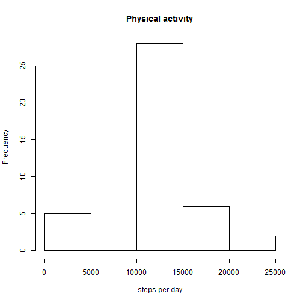
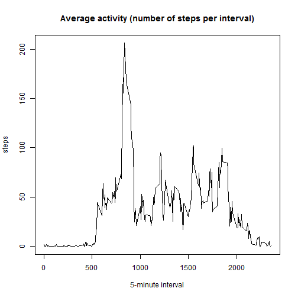
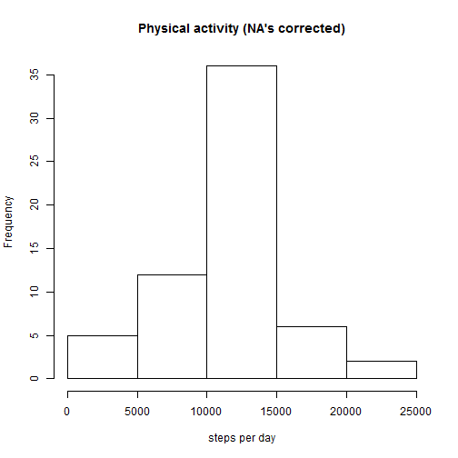
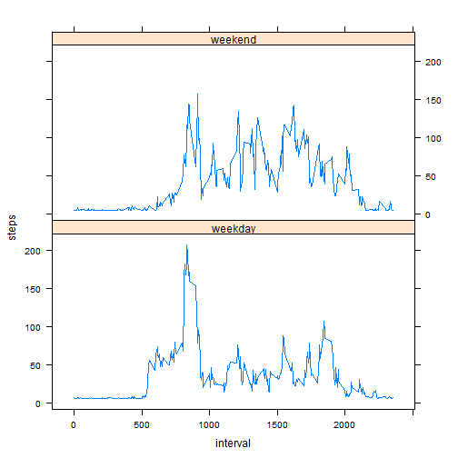

This is an R Markdown document. It is my submission for the peer assignment #1 of Coursera's "Reproducible Research" course.

# Setup

We load any additional package that might be needed.


```r
library(plyr)
library(lattice)

Sys.setlocale("LC_TIME", "C") # override the Brazilian locale
```

```
## [1] "C"
```

# Loading data

First, we load and process ("clean") the data.


```r
setwd('c:/cygwin64/home/00240181/src/ReproducibleResearch/RepData_PeerAssessment1')
data <- read.csv("activity.csv")
```

```
## Warning in file(file, "rt"): cannot open file 'activity.csv': No such file
## or directory
```

```
## Error in file(file, "rt"): cannot open the connection
```

```r
data.clean <- data[which(data$steps != "NA"), ]
```

It is valid to check the data to have an idea about how it is structured.


```r
summary(data.clean)
```

```
##      steps                date          interval     
##  Min.   :  0.00   2012-10-02:  288   Min.   :   0.0  
##  1st Qu.:  0.00   2012-10-03:  288   1st Qu.: 588.8  
##  Median :  0.00   2012-10-04:  288   Median :1177.5  
##  Mean   : 37.38   2012-10-05:  288   Mean   :1177.5  
##  3rd Qu.: 12.00   2012-10-06:  288   3rd Qu.:1766.2  
##  Max.   :806.00   2012-10-07:  288   Max.   :2355.0  
##                   (Other)   :13536
```

```r
head(data.clean)
```

```
##     steps       date interval
## 289     0 2012-10-02        0
## 290     0 2012-10-02        5
## 291     0 2012-10-02       10
## 292     0 2012-10-02       15
## 293     0 2012-10-02       20
## 294     0 2012-10-02       25
```

# First question

Code for the question **What is mean total number of steps taken per day?**


```r
# extract the "total number of steps taken each day" and show a summary
daily.steps <- ddply(data.clean, .(date), summarise, steps = sum(steps))
summary(daily.steps)
```

```
##          date        steps      
##  2012-10-02: 1   Min.   :   41  
##  2012-10-03: 1   1st Qu.: 8841  
##  2012-10-04: 1   Median :10765  
##  2012-10-05: 1   Mean   :10766  
##  2012-10-06: 1   3rd Qu.:13294  
##  2012-10-07: 1   Max.   :21194  
##  (Other)   :47
```

```r
# plot the distribution and get a summary of the data
hist(daily.steps$steps, main="Physical activity", xlab="steps per day")
```

 

The mean number of steps is 10766.19, while the median is 10765.

# Second question

Code for the question **What is the average daily activity pattern?**


```r
# extract the data
average.steps <- ddply(data.clean, .(interval), summarise, steps = mean(steps))

# plot the avarage daily activity
plot(average.steps$interval, average.steps$steps, type = "l", xlab = "5-minute interval", 
    ylab = "steps", main = "Average activity (number of steps per interval)")
```

 

```r
# extract the 5-minute interval with the maximum number of steps
average.steps[average.steps$steps == max(average.steps$steps), ]
```

```
##     interval    steps
## 104      835 206.1698
```

# Third question

Code for the question **Imputing missing values**.

The total number of missing values is 2304.


```r
# replaces NA's with the 5-minute interval average
data.corrected <- data
data.corrected[is.na(data$steps), "steps"] <- mean(na.omit(data.corrected$steps))

# extract the data
daily.steps.corrected <- ddply(data.corrected, .(date), summarise, steps = sum(steps))

# plot the distribution and get a summary of the data
hist(daily.steps.corrected$steps, main="Physical activity (NA's corrected)", xlab="steps per day")
```

 

The mean number of steps is 10766.19, while the median is 10766. These values don't differ significately from the first part of the assignment, and we conclude that in this case the missing data does not affect the analysis.

# Fourth question

Code for the questions **Are there differences in activity patterns between weekdays and weekends?**


```r
weekdays <- weekdays(as.Date(data.corrected$date))
data.weekdays <- transform(data.corrected, day = weekdays)
data.weekdays$wk <- ifelse(data.weekdays$day %in% c("Saturday", "Sunday"), "weekend", "weekday")
data.week_quest <- ddply(data.weekdays, .(interval, wk), summarise, steps = mean(steps))

xyplot(steps ~ interval | wk, data = data.week_quest, layout = c(1, 2), type = "l")
```

 

```r
summary(subset(data.week_quest, wk=='weekend'))
```

```
##     interval           wk                steps        
##  Min.   :   0.0   Length:288         Min.   :  4.673  
##  1st Qu.: 588.8   Class :character   1st Qu.:  5.642  
##  Median :1177.5   Mode  :character   Median : 32.704  
##  Mean   :1177.5                      Mean   : 42.366  
##  3rd Qu.:1766.2                      3rd Qu.: 70.798  
##  Max.   :2355.0                      Max.   :157.798
```

```r
summary(subset(data.week_quest, wk=='weekday'))
```

```
##     interval           wk                steps        
##  Min.   :   0.0   Length:288         Min.   :  4.984  
##  1st Qu.: 588.8   Class :character   1st Qu.:  6.907  
##  Median :1177.5   Mode  :character   Median : 25.762  
##  Mean   :1177.5                      Mean   : 35.611  
##  3rd Qu.:1766.2                      3rd Qu.: 49.940  
##  Max.   :2355.0                      Max.   :207.873
```

We verify that the average and the maximum number of steps is higher on weekdays. Future work should test the hypothesis that this difference is not random.
